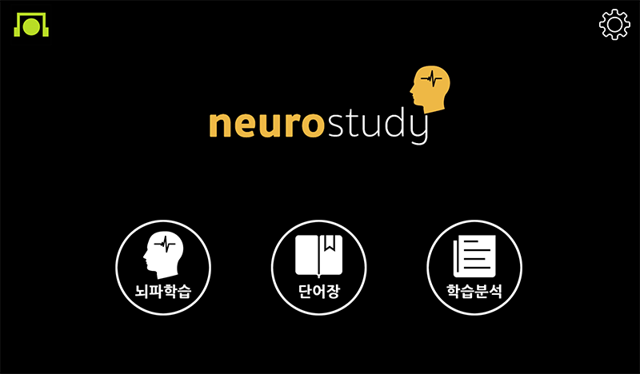

=========

---

## neurostudy?

뉴로스터디는 뇌파 피드백을 기반으로 스마트한 단어 학습을 도와주는 모바일 어플리케이션입니다.

현재는 영어만을 지원하고 있지만 다양한 외국어를 지원할 예정입니다.

## 기본 컨셉

- 뇌파 워밍업

학습에 앞서 집중에 도움이 되는 음악과 뇌파 피드백을 통하여 사용자의 뇌파를 집중하기 쉬운 상태로 유도하여 학습에 적합한 상태로 유도합니다

- 뇌파 학습

사용자가 학습에 얼마나 집중하는지를 측정하여 학습의 형태를 다르게 하여 효율적인 학습이 가능하도록 합니다

예를 들어 사용자가 집중을 하지 못하고 있을 경우 한 단어의 학습 시간을 늘리거나 문제를 통하여 주의를 환기할 수 있게 합니다

- 뇌파 쿨다운

학습이 끝난 후 긴장되었던 사용자의 정신을 명상을 통하여 편안한 상태로 이완할 수 있도록 도와줍니다.

## 특징

뉴로스터디는 단어 학습시 한글 발음 텍스트, 영어 스펠링, 관련 이미지, 한글 뜻, 영어 발음을 제공합니다.

일반적으로 뇌는 친숙한 것을 기반으로 그것과 관계된 다른 것들을 기억할 때 큰 효율을 발휘하므로

친숙한 한글 발음 텍스트를 중심축으로 두고 나머지를 관계적으로 기억할 수 있도록 유도합니다.

예를 들어 apple이라는 단어를 암기한다고 했을 때 일반적인 단어장에는 apple이라는 영어 스펠링과 [|ӕpl]이라는 발음 정보,

그리고 사과라는 한글 뜻 정보를 제공합니다.

이 때 사용자는 |ӕpl이라는 발음을 축으로 apple이라는 스펠링과 사과라는 뜻을 기억하게 됩니다.

하지만 |ӕpl라는 정보는 체계적으로 정리하기에 익숙하지 않은 정보이고 청각적인 감각을 기반으로 하기 때문에 기억하기가 쉽지 않습니다.

이런 부분에서 착안하여 애플이라는 한글 발음 텍스트를 먼저 제공하고 기억을 할 수 있는 친숙한 축을 제공합니다.

이 축을 기반으로 손쉽게 apple이라는 스펠링 정보와 사과라는 뜻을 기억할 수 있게 하며

|ӕpl이라는 청각적 발음 정보와 사과 이미지라는 시각적 이미지 정보를 동시에 제공하여

공감각적 경험을 통하여 쉽고 길게 기억할 수 있도록 도와줍니다.

## 지원 뇌파 헤드셋

- [neurosky mindwave MOBILE](https://store.neurosky.com/pages/mindwave)

## 배포

- 안드로이드

- [구글 플레이 스토어](https://play.google.com/store/apps/details?id=com.neurocloud.neurostudy)